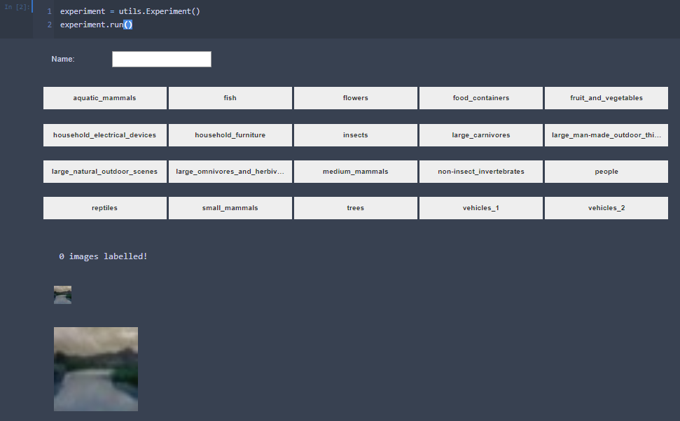

# Volunteer Labeller Instructions

First of all, many thanks for helping to provide data for this project! Hopefully these instructions are clear and the process is easy, but please reach out if you have any questions or issues.

1. Clone the repo
   * `git@github.com:carsonmclean/csc2558.git`
   *  `https://github.com/carsonmclean/csc2558.git`
2. Download the dataset
   * [Full CIFAR-100 pre-processed dataset download](https://drive.google.com/file/d/1OopivzWB4wVVZXxTg6hHv2oh_Ol6MnXc/view?usp=sharing) (183MB)
     * Output of [create_cifar_100_pandas.ipynb](../src/notebooks/create_cifar_100_pandas.ipynb). 60,000 images, complete dataset.
   * [Smaller CIFAR-100 pre-processed dataset download](https://drive.google.com/file/d/1gkVRbQ-hYa01X1FqRcjXagjT-HyRAMII/view?usp=sharing) (31MB)
     * 10,000 images sampled randomly from complete dataset.
    * Save either dataset within the CSC2558 repo at `data/cifar-100/cifar-100.pkl`
3. Install packages
   * `jupyter, numpy, pandas, opencv`
4. Start up Jupyter server and run [labelling.ipynb](../src/notebooks/labelling.ipynb)
5. Within the notebook, please take a second to look at the fine label/_Classes_ categories contained within the coarse/_Superclass_ labels, which correspond to the buttons available in the third notebook cell.
   * 
   * Tip: I sometimes `Ctrl+F` while labelling if I identify the Class (EG: `raccoon`) but forget what Superclass that belongs to. Saves time vs re-reading and scrolling up.
   * Tip: The buttons below are in alphabetical order, just like the Superclasses/coarse labels above.
6. Please enter your name or any other string identifier into the `Name: ____` box.
   * 
   * This can be made up, but something somewhat unique would be nice to differentiate the various volunteers' responses.
   * This field auto-updates, so changing the text during a labeling session will be reflected in the next CSV annotation entry.
7. Label images!
   * Both an original size CIFAR-100 image (32x32) and enlarged image (150x150) version are displayed. Resolution quality is quite low in the CIFAR datasets, but this adds to the challenge of the task.
   * The volunteer labeller's goal is to maximize `# of correct images/min`, so both speed and accuracy count. Approach the task as if you were an [Amazon Mechanical Turk](https://www.mturk.com/) worker, meaning don't try _too_ hard but do pretend you are being paid a couple cents for each correct label. Sometimes guessing is better than spending too much time, but that's up to your discretion!
   * Please complete **at least 100 images** in a single session. I estimate this to take ~10 minutes.
   * If you're able, more data is appreciated! This could be over multiple sessions (ie, restarting notebook/Jupyter Server). The data should just keep being appended to the CSV.
     * Using different names between sessions with a large time break would be appreciated but is not necessary.
     * EG: `Geoffrey H 1` and then `Geoffrey H 2`
8. Send back completed annotations CSV for analysis
    * Within the repo, annotations will be located at `data/cifar-100/annotations.csv`. This is just a regular CSV, so feel free to double check your responses are being recorded as you expect.
    
    
Thank you very much for your time! 

P.S.
If there is a good guide on getting something like this running on Colab, please let me know! 